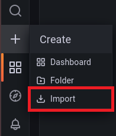

# Important information before installing

## Folder structure
```
grafana-influxdb-telegraf
|   configuration.env
|   docker-compose.yml
|   README.md
|
└───grafana
|   |
|   └───dashboards
|           dashboards.json
|
└───images
|       ...
|
└───publisher
|       pub.py
|
└───telegraf
    |
    └───config
    |       sample.conf
    |       telegraf.conf
```

## Environment information
- OS: Ubuntu 18.04 LTS

## Softwares
- Docker Engine: lastest version
- Docker Compose: v1.29.2, build 5becea4c

## Services in docker
- grafana: v8.5.4
- influxdb: v1.8 version (v1.x)
- telegraf: latest version

# Install all services on ubuntu

## Steps for using the project
First, install docker engine, please refer to the following steps.
- Install dependencies
    ```
    sudo apt-get install ca-certificates curl gnupg lsb-release net-tools -y
    ```
- Add docker's official GPG key
    ```
    curl -fsSL https://download.docker.com/linux/ubuntu/gpg | sudo gpg --dearmor -o /usr/share/keyrings/docker-archive-keyring.gpg
    ```
- Set up stable repository
    ```
    echo \
    "deb [arch=$(dpkg --print-architecture) signed-by=/usr/share/keyrings/docker-archive-keyring.gpg] https://download.docker.com/linux/ubuntu \
    $(lsb_release -cs) stable" | sudo tee /etc/apt/sources.list.d/docker.list > /dev/null
    ```
- Update packages
    ```
    sudo apt-get update
    ```
- Install docker
    ```
    sudo apt-get install docker-ce docker-ce-cli containerd.io -y
    ```
Second, install docker compose
- Download the execution file
    ```
    sudo curl -L https://github.com/docker/compose/releases/download/1.29.2/docker-compose-`uname -s`-`uname -m` -o /usr/local/bin/docker-compose
    ```
- Configure permissions
    ```
    sudo chmod +x /usr/local/bin/docker-compose
    ```
- Check version
    ```
    docker-compose --version
    ```

# Modify configuration files, install and run docker containers

You should already have docker and docker compose installed. Next please download the project (via git or directly).

Try to modify it to your local ip.(via `ifconfig`)<br>
/telegraf/config/telegraf.conf line 129
```
urls = ["http://$IP:8086"]
```

Open cmd or terminal, move to the root directory, and execute the following command:
```
sudo docker-compose up -d
```

After completion you can check running containers and their port numbers with `docker ps`.

# Add data sources and dashboards to grafana

Now you can enter [localhost:3000](localhost:3000) in the URL bar to go to the main page of grafana.

Follow the steps below to add data sources and dashboards
1. Click Import

      

2. Copy dashboard json data and load it

      

3. Click data sources

      

4. Search `influxdb` service

      

5. Fill in information and click Save & test button
    - HTTP URL: `http://$IP:8086` (Fill in your ip instead localhost)
    - InfluxDB Database: `iii` (same as database name in telegraf.conf)
    - InfluxDB User: `admin`
    - InfluxDB Password: `admin`

6. Click Search dashboards and then click the imported dashboard (test)

      


7. View the panels displayed on the dashboard

      

# Others
If you are starting with a new ubuntu 18.04 operating system, please refer to the following installation instructions
- Update and upgrade
    ```
    sudo apt-get install -y && sudo apt-get upgrade -y && sudo apt autoremove -y
    ```
